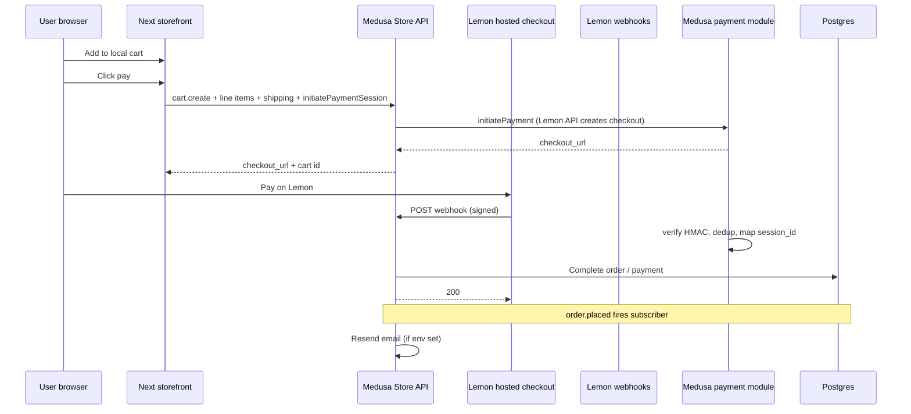

# Runtime logic and data flow (export)

This document describes **what actually runs**, **how data moves**, and **what each subsystem does in code** for the Universal Music Store monorepo (`universal-music-store/`). It is written for handoff, audits, or PDF export. Paths are relative to `universal-music-store/` unless noted.

---

## 1. Running processes (four separate Node concerns)

| Process | How it starts | What it loads first | Persistent state |
|--------|----------------|----------------------|------------------|
| **Next.js storefront** | `pnpm dev` / `next start` in `apps/storefront` | Next loads `instrumentation.ts` on the **Node** runtime only | None server-side by default; cart in **browser** |
| **Next.js admin** | `pnpm dev` in `apps/admin` | Standard Next bootstrap | Session store for NextAuth |
| **Medusa** | `medusa develop` / `medusa start` in `apps/medusa` | `medusa-config.ts`: `loadEnv`, then `validateMedusaProcessEnv()` | **Postgres** via `DATABASE_URL` |
| **Express API** | `node` / `pnpm` in `apps/api` | `src/index.ts`: helmet, CORS, JSON, routes | None; stateless |

These processes **do not share memory**. They coordinate only through **HTTP** (storefront and admin call Medusa Store/Admin APIs), **Postgres** (Medusa), and **environment variables**.

---

## 2. Storefront: boot-time behavior

**File:** `apps/storefront/instrumentation.ts`

- Next.js calls `register()` when the server runtime starts (`NEXT_RUNTIME === "nodejs"`).
- It dynamically imports `assertMedusaStorefrontEnvProduction` from `@universal-music-store/sdk`.
- In **production**, if publishable key, region id, or public Medusa base URL are wrong (including localhost base URL), the server **throws** during startup so the deploy fails fast instead of serving a broken shop.

**File:** `packages/sdk/src/env/medusa-storefront.ts`

- `listMissingMedusaStorefrontEnv()` checks `getMedusaPublishableKey()`, `getMedusaRegionId()`, and in production rejects localhost Medusa URLs.
- `assertMedusaStorefrontEnvProduction()` throws with a joined message of missing items.

**Net effect:** Production storefront refuses to boot with incomplete Medusa client configuration.

---

## 3. Catalog browse: logic and data flow

**Goal:** Render product grids and PDP from Medusa, mapped into your shared `Product` type.

**Entry:** Server components or pages import `fetchProductsPage`, `fetchProductBySlug`, etc. from `apps/storefront/src/lib/catalog-fetch.ts`.

**Step-by-step (products list):**

1. **`requireMedusaClientConfig()`**  
   If publishable key or region id is missing, the function returns `{ kind: "misconfigured", detail: "..." }` instead of empty arrays. That is how misconfiguration is distinguished from “no products”.

2. **`createStorefrontMedusaSdk()`** (`medusa-sdk.ts`)  
   Builds `@medusajs/js-sdk` with `getMedusaStoreBaseUrl()` and `getMedusaPublishableKey()`. Throws if key missing (defensive).

3. **Optional category resolution**  
   `resolveMedusaCategoryId` calls `sdk.store.category.list`, matches name or handle case-insensitively, returns Medusa category id for filtering.

4. **Product list**  
   `sdk.store.product.list` is called with `region_id`, pagination, optional `category_id`, `q`, `fields` including variants and calculated prices.  
   For client-side filters (size/color) or price sort, the code may **scan** additional pages up to a cap, then filter or sort in memory (performance tradeoff documented in code).

5. **Mapping**  
   Each raw Medusa product passes through `mapMedusaProductToProduct` (`medusa-catalog-mapper.ts`) into `@universal-music-store/types` `Product` for UI.

**Data direction:** Browser never talks to Postgres. **HTTPS** from Next server or RSC to Medusa **Store API** only. The publishable key identifies the sales channel context Medusa expects.

---

## 4. Cart and checkout: logic and data flow

### 4.1 Local cart (browser)

**File:** `apps/storefront/src/lib/cart.ts`

- Cart lines hold **Medusa variant ids**, quantities, and display fields (price, title) copied at add-to-cart time.
- Storage is **local** (e.g. `localStorage`). Medusa does not see this cart until checkout starts.

**Implication:** Inventory is not reserved in Medusa until you build a server cart during checkout. Two tabs can race; Medusa checkout flow should handle sold-out at payment time.

### 4.2 Checkout (Lemon via Medusa payment session)

**File:** `apps/storefront/src/app/(public)/checkout/page.tsx` (client) calls **`startMedusaLemonCheckout`** in `medusa-checkout.ts`.

**Exact sequence in `startMedusaLemonCheckout`:**

1. Runs only in the **browser** (`window` check).
2. Instantiates Medusa JS SDK with publishable key and Medusa base URL.
3. **`sdk.store.cart.create`** with `region_id` → new Medusa cart id.
4. For each local line: **`sdk.store.cart.createLineItem`** with `variant_id` and `quantity`.
5. Optional **`sdk.store.cart.update`** with email.
6. **`sdk.store.fulfillment.listCartOptions`** → picks **first** shipping option id. Failure throws if none (misconfigured region/shipping profile).
7. **`sdk.store.cart.addShippingMethod`** with that option.
8. **`sdk.store.cart.retrieve`** with expanded payment collection fields.
9. **`sdk.store.payment.initiatePaymentSession`** with `provider_id` from env (default Lemon module id).
10. Finds a session whose `provider_id` contains `lemonsqueezy` or falls back to first session.
11. Reads **`checkout_url`** from session `data` and returns `{ checkoutUrl, cartId }` to the page.

**User leaves your site** to Lemon’s hosted checkout. Payment truth is **not** the return URL alone; Medusa completes payment through provider + webhook (below).

---

## 5. Medusa: payment provider (Lemon) — server-side logic

**Registration:** `apps/medusa/medusa-config.ts` merges Lemon, Stripe, COD, PayPal, Paymongo into `@medusajs/medusa/payment` when env vars are present.

### 5.1 `initiatePayment` (Lemon module)

**File:** `apps/medusa/src/modules/lemonsqueezy-payment/service.ts` → `initiatePayment`

- Requires `session_id` on the payment session (Medusa internal id for the payment session).
- Reads cart **amount** from Medusa input; validates finite amount ≥ 1 (minor units path depends on Medusa amount semantics).
- **POST** `https://api.lemonsqueezy.com/v1/checkouts` with JSON:API body:
  - `custom_price` from amount
  - `checkout_data.custom.medusa_payment_session_id` = session id (this is how webhooks correlate back)
  - Links store and **checkout variant** from module options
- Parses response; enforces **HTTPS** URL and host must be `lemonsqueezy.com`.
- Returns Medusa payment session `data` including `checkout_url`, `checkout_id`, `session_id`, status **REQUIRES_MORE** (user must pay off-site).

### 5.2 Webhook: paid order

**Method:** `getWebhookActionAndData`

1. Normalizes raw body to `Buffer`, reads `x-signature` header.
2. **`verifyLemonSignature`:** HMAC-SHA256 hex of raw body with `webhookSecret`, compared with **`crypto.timingSafeEqual`** to the header (constant-time).
3. Parses JSON; **`isPaidOrderWebhook`** requires `meta.event_name === "order_created"` and order `status === "paid"` in payload.
4. **Dedup:** `buildLemonWebhookDedupId` + `claimLemonWebhookDedup` so duplicate deliveries do not double-apply.
5. **`extractMedusaSessionId`** from `meta.custom_data` or `checkout_data.custom` (must match the id embedded at checkout creation).
6. **`extractPaidTotalMinor`** from payload totals.
7. Returns Medusa action **SUCCESSFUL** with `{ session_id, amount }` so the payment module can mark the Medusa payment session paid and complete the order workflow.

**What this means for data integrity:** Order is not “paid” in Medusa from the client redirect. It is completed when **signed** Lemon webhook matches a known payment session id and passes dedup.

### 5.3 `authorizePayment` (polling path)

- Uses Lemon REST to fetch checkout by id, then order, and checks order status **paid**. Used when Medusa workflow authorizes without webhook ordering; hosted checkout still must end in `paid` on Lemon’s side.

---

## 6. Order placed → email (Resend)

**File:** `apps/medusa/src/subscribers/order-placed-resend-email.ts`

- Subscribes to Medusa **order placed** event with order id.
- If `RESEND_API_KEY`, `RESEND_FROM_EMAIL`, and storefront base URL are missing, **returns without sending** (no throw).
- Resolves **order module**, loads order with `customer` relation.
- Picks email from order or linked customer.
- Builds **tracking URL** as `{storefrontBase}/track/{order.id}` (uses Medusa order id, not display id in path).
- Sends HTML email via Resend.

**Data flow:** Medusa DB → event bus → subscriber → Resend API → customer inbox. No Express in this path.

---

## 7. Admin POS: auth, lookup, sale completion

### 7.1 Staff gate

**Pattern:** Route handlers call `requireStaffSession()` from `apps/admin/src/lib/requireStaffSession.ts` (not pasted here, but every POS route depends on it). If not staff, returns NextResponse with error status before any Medusa call.

### 7.2 Lookup

**File:** `apps/admin/src/app/api/pos/medusa/lookup/route.ts`

1. Parses JSON `barcode` or `sku`.
2. Requires Medusa region + **both** store SDK (publishable) and **admin** SDK (secret) for fallback search.
3. **First attempt:** Store API `product.list` with `q`, walks variants; matches **sku** or **ean/barcode** fields if present.
4. **Second attempt:** Admin `product.list`, then **retrieve** product through Store API with `region_id` to get **calculated_price** for the region.
5. Maps options to size/color via `optionRowsToSizeColor`, price via `variantPricePhpFromCalculated`.
6. Returns JSON `{ id, sku, size, color, price, products: { name } }` or 404.

**Data flow:** Staff browser → Next server route → Medusa Store/Admin HTTP APIs → JSON to POS UI. Secrets never go to the browser.

### 7.3 Commit sale

**File:** `apps/admin/src/app/api/pos/medusa/commit-sale/route.ts`

1. Validates env: admin SDK, `region_id`, `sales_channel_id`.
2. **`admin.draftOrder.create`** with email (default placeholder if missing), `region_id`, `sales_channel_id`, line items.
3. **`admin.draftOrder.convertToOrder`** on that draft.
4. Returns `{ orderNumber }` from `display_id` or id.

**Data flow:** Creates a **real Medusa order** in Postgres through Admin API. Inventory and payment rules follow Medusa configuration (e.g. payment status depends on how you complete payment for POS).

---

## 8. Tracking page: logic

**File:** `apps/storefront/src/lib/medusa-track-fetch.ts`

**By order id:**

- `sdk.store.order.retrieve` with fulfillments and labels expanded.
- `mapMedusaOrderToTrack` derives a **single** status string for UI:
  - Reads `metadata.aftership_status` first for carrier state.
  - Else uses `payment_status` and `fulfillment_status` to infer `pending_payment`, `shipped`, `delivered`, etc.
- Builds `shipments[]` from fulfillment labels when present.

**By cart id (post-checkout handoff):**

- Retrieves cart with `order` relation. If cart linked to an order id, **delegates** to `fetchMedusaTrackByOrderId`.
- If no order yet, returns synthetic `pending_payment` payload so the UI can show “waiting for payment” state.

---

## 9. Express API (current scope)

**File:** `apps/api/src/index.ts`

- Attaches **request id** middleware, **helmet**, **CORS** (strict in production when `CORS_ORIGIN` set), **JSON** body parser.
- **Production:** exits if `INTERNAL_API_KEY` missing.
- Routes:
  - **`GET /health`** (and nested health from `healthRouter`) for probes.
  - **`/compliance`** behind **`requireInternalApiKey`**: Bearer token must match `INTERNAL_API_KEY`.

**Role in commerce:** This build does **not** host catalog, checkout, or webhooks. It is a **small operational** HTTP surface. Medusa owns commerce HTTP for Store and Admin APIs.

---

## 10. Shared SDK (not business logic)

**Package:** `packages/sdk`

- Exposes **resolved** Medusa URL, keys, region, sales channel helpers used by storefront and admin.
- **Production assertions** for storefront env (used by `instrumentation.ts`).
- Does **not** implement payments or inventory; it only centralizes **configuration** reads.

---

## 11. End-to-end sequence (online purchase, Lemon)

---

## 12. What is intentionally not centralized here

- **Medusa internal workflow engine** (how exactly `PaymentSession` transitions): behavior is Medusa core + your module; use Medusa Admin or DB inspection for debugging.
- **NextAuth internals** for admin staff: see `requireStaffSession` and NextAuth config in admin app.
- **AfterShip** subscriber and hook routes under `apps/medusa/src/subscribers` and `src/api/hooks/aftership` (same report style if you extend this doc).

---

*Document version: aligned with codebase review. Update when payment or POS flows change.*
