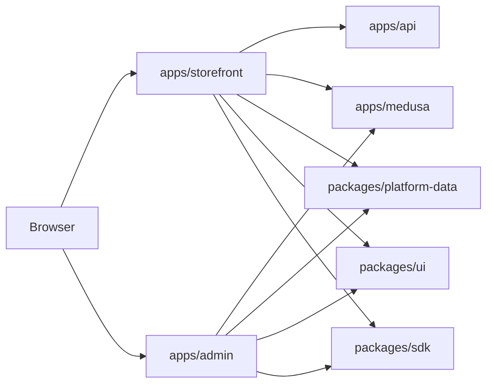

# Architecture Overview

## Verified Status

- Smoke harness: `pnpm test:e2e:critical`
- Result: `16 passed, 2 skipped`
- Key regressions fixed during this pass:
  - `next-auth` shim resolution now uses static re-exports instead of runtime file-system lookup.
  - Admin auth middleware now exports `withAuth` correctly.
  - Storefront and admin unauthenticated API surfaces now return `401` instead of `500`.

## System Summary

This repository is a monorepo ecommerce platform with:

- `apps/storefront`: customer-facing shop, account, checkout, content, wishlist, reviews
- `apps/admin`: staff dashboard, catalog, inventory, orders, CMS, POS, settings
- `apps/api`: support API and health endpoints
- `apps/medusa`: commerce backend
- `packages/*`: shared UI, SDK, validation, database, and business-domain packages

## Core UX Stack

- Frontend: Next.js App Router, React, TypeScript
- UI system: `packages/ui` primitives plus app-specific chrome and shells
- Auth: `next-auth`
- Commerce data: Medusa + shared platform-data helpers
- Analytics/guardrails: PostHog, Vercel Analytics, BotId protection, consent banner

## High-Level Data Flow

## Storefront

### Layouts

- `apps/storefront/src/app/layout.tsx`
  - Global metadata, fonts, theme color, canonical base, robots, icons, manifest
  - Installs `NextAuthSessionProvider`, `MedusaCartProvider`, analytics, BotId client protection
  - Adds cart sync, wishlist sync, onboarding guard, smooth scrolling, cookie consent
- `apps/storefront/src/app/(public)/layout.tsx`
  - Wraps public routes in `StorefrontPublicChrome`

### Page Routes

#### Home and discovery

- `/` -> `apps/storefront/src/app/(public)/page.tsx`
  - Home landing with CMS-driven sections and featured commerce content
  - Metadata: canonical home URL, site-wide metadata inherited from root
- `/shop` -> `.../(public)/shop/page.tsx`
  - Product listing with filters, sort, search typeahead, price range, pagination, CMS category banner
  - Components: `CatalogProductCard`, `CatalogSearchTypeahead`, `ShopPriceRangeForm`, `ShopSortSelect`, `StorefrontCommerceAlert`, `CmsBlocksRenderer`
  - Metadata: canonical URL built from query state, `prev`/`next` pagination links, Open Graph title/description
- `/shop/[slug]` -> `.../(public)/shop/[slug]/page.tsx`
  - PDP with carousel, add-to-cart, compare link, reviews, QA, shipping estimate, trust badges, related products
  - Components: `ProductGalleryCarousel`, `AddToCartSection`, `ProductRatingNearTitle`, `ProductDetailsAccordions`, `ProductReviewsSection`, `ProductQaSection`, `ShippingDeliveryEstimate`, `TrustBadgesStrip`, `ShareProductButton`, `ProductViewTracker`
  - Metadata: product title, description, canonical, Open Graph, Twitter card, Product JSON-LD, Breadcrumb JSON-LD
- `/p/[slug]` -> `.../(public)/p/[slug]/page.tsx`
  - CMS/public page renderer with preview support
  - Components: `CmsBlocksRenderer`
  - Metadata: CMS title/description/canonical, Open Graph image when present, preview mode is `noindex`
- `/blog` and `/blog/[slug]`
  - Blog listing and article pages
  - Metadata: canonical URLs, article JSON-LD on detail pages
- `/collections` and `/collections/[handle]`
  - Collection listing/detail surfaces
- `/search`
  - Search entry point for catalog discovery

#### Commerce and checkout

- `/cart`
  - Cart overview and update path
- `/checkout`
  - Checkout shell with payment provider selection, session-aware cart state, trust and review surfaces
  - Components: `CheckoutClient`, payment provider rows, `CheckoutTrustBadges`, `PayPalEmbeddedCheckout`, payment-return helpers
  - Metadata: checkout-specific page title/description
- `/checkout/stripe-return`
  - Hosted payment return handling
- `/checkout/hosted-return`
  - Hosted return page for external PSP flows
- `/order-confirmation/[orderId]`
  - Post-purchase confirmation and receipt summary
- `/track`
  - Tracking lookup entry
- `/track/[orderId]`
  - Tracking detail by order or token
- `/returns`
  - Returns policy and workflow entry

#### Account and identity

- `/sign-in`
  - Customer sign-in
  - Metadata: auth-focused, usually noindex on auth-sensitive pages
- `/register`
  - Customer registration
- `/account`
  - Account dashboard
  - Uses `NextAuthSessionProvider`, account profile panel, and order history state
- `/account/orders/[orderId]`
  - Order detail
- `/account/orders/[orderId]/return`
  - Return request flow
- `/wishlist`
  - Wishlist management
- `/preferences`
  - Customer preference controls
- `/onboarding`
  - First-run user guidance / guard-driven setup

#### Support and trust

- `/help`
- `/faq`
- `/contact`
- `/shipping`
- `/warranty`
- `/privacy`
- `/terms`
- `/cookies`
- `/accessibility`
- `/maintenance`
- `/errors/[code]`
- `/sitemap`

### Storefront API Routes

Primary domains:

- Auth: `/api/auth/[...nextauth]`
- Account: `/api/account/profile`, `/api/account/profile/status`, `/api/account/orders/[orderId]/cancel`
- Cart: `/api/cart/resume`, `/api/cart/merge`, `/api/cart/attach-customer`, `/api/cart/medusa-bind`, `/api/cart/abandonment`
- Checkout: `/api/checkout/*` including promo, available payment methods, COD payload/place-order, totals preview, stock verification, receipt upload, telemetry, completion
- Orders and returns: `/api/orders/return`
- Wishlist: `/api/wishlist`, `/api/wishlist/sync`
- Reviews: `/api/reviews`, `/api/reviews/helpful/[id]`
- CMS/public content: `/api/cms/preview`, `/api/cms/announcement/track`, `/api/cms/experiments/impression`
- Monitoring: `/api/health`, `/api/health/sop`
- Internal/cron: `/api/cron/finalize-payment-attempts`, `/api/internal/*`
- Discovery: `/api/shop/product`, `/api/shop/search-suggest`, `/api/catalog/product-default-variant`

### Storefront UX Component Inventory

Shared shell and behavior:

- `StorefrontHeader`, `StorefrontMainNav`, `StorefrontNav`, `StorefrontFooter`, `StorefrontUtilityBar`
- `StorefrontPublicChrome`, `GlobalRouteMotion`, `SmoothScrollProvider`
- `CookieConsentBanner`, `VercelWebAnalytics`, `PostHogAnalytics`

Commerce and conversion:

- `AddToCartSection`, `CartSyncOnSignIn`, `CartAbandonmentBeacon`
- `CheckoutTrustBadges`, `PayPalEmbeddedCheckout`, `PaymentProviderLogo`
- `ProductGalleryCarousel`, `ProductImageZoom`, `ProductQuickViewModal`, `QuickViewButton`
- `ProductRatingNearTitle`, `ReviewStarRatingDisplay`, `ProductReviewsSection`, `ProductReviewsFeedClient`, `ProductReviewForm`
- `ProductQaSection`, `ProductDetailsAccordions`, `ShippingDeliveryEstimate`, `TrustBadgesStrip`
- `WishlistToggle`, `WishlistPageClient`, `WishlistSyncOnLogin`
- `OrderCancelButton`, `OrderReturnForm`, `HostedCheckoutReturn`

Content and utility:

- `CmsAnnouncementBar`, `CmsBlocksRenderer`, `CmsExperimentAssigner`
- `ContactSupportForm`, `PreferencesControls`, `StorefrontPreferenceSync`, `StorefrontCommerceAlert`
- `AccountProfilePanel`, `OnboardingGuard`, `BrowsePriceFreshnessCue`, `BackInStockNotify`

### Storefront Metadata Pattern

- Root layout defines:
  - title template
  - site description/keywords
  - Open Graph and Twitter defaults
  - canonical base URL
  - robots rules
  - icons and web manifest
- PDP metadata is product-driven and emits JSON-LD
- Blog and CMS pages use canonical URLs and preview/noindex handling
- Auth and checkout-adjacent pages are handled as conversion flows, not indexable marketing pages

## Admin

### Layouts

- `apps/admin/src/app/layout.tsx`
  - Root admin metadata, fonts, session provider, analytics, Lenis scrolling
- `apps/admin/src/app/(dashboard)/layout.tsx`
  - Wraps dashboard routes in `AdminDashboardChrome`

### Page Routes

#### Entry and dashboard

- `/admin`
  - Overview dashboard
  - Shows order counts, stock alerts, recent orders, inventory summaries, activity timeline
  - Redirects unauthenticated or unauthorized users
- `/sign-in`
  - Staff sign-in
  - Metadata: `noindex`, `nofollow`
- `/sign-in/e2e`
  - E2E-only auth path

#### Commerce operations

- `/admin/orders`
- `/admin/orders/[orderId]`
- `/admin/inventory`
- `/admin/pos`
- `/admin/receipts`
- `/admin/payments`
- `/admin/reviews`
- `/admin/offline-queue`
- `/admin/workflow`
- `/admin/finance/reconciliation`
- `/admin/analytics`
- `/admin/commerce-metrics`

#### Catalog and product management

- `/admin/catalog`
- `/admin/catalog/[id]`
- `/admin/catalog/new`
- `/admin/catalog/media`
- `/admin/channels`
- `/admin/chat-orders`

#### CMS and content operations

- `/admin/cms`
- `/admin/cms/announcement`
- `/admin/cms/blog`
- `/admin/cms/blog/[id]`
- `/admin/cms/categories`
- `/admin/cms/commerce`
- `/admin/cms/employees`
- `/admin/cms/experiments`
- `/admin/cms/forms`
- `/admin/cms/media`
- `/admin/cms/navigation`
- `/admin/cms/pages`
- `/admin/cms/payment-links`
- `/admin/cms/redirects`
- `/admin/cms/site-map`
- `/admin/cms/users`

#### Staff, CRM, devices, settings

- `/admin/crm`
- `/admin/crm/[customerId]`
- `/admin/devices`
- `/admin/employees`
- `/admin/settings`
- `/admin/settings/payments`
- `/admin/settings/preferences`
- `/admin/settings/reasons`
- `/admin/settings/storefront`
- `/admin/settings/integrations`
- `/admin/docs`
- `/admin/audit`

### Admin API Routes

Primary domains:

- Auth/session enforcement: `/api/auth/[...nextauth]`
- Orders, payments, receipts, refunds: `/api/admin/orders/*`, `/api/admin/payments/*`, `/api/admin/receipts`, `/api/admin/payment-health`, `/api/admin/reconciliation`
- Catalog: `/api/admin/catalog/*`
- CMS: `/api/admin/cms/*`
- CRM: `/api/admin/crm/*`
- Inventory: `/api/admin/inventory`, `/api/admin/inventory/stream`
- Devices and POS: `/api/admin/devices/*`, `/api/admin/pos/*`, `/api/pos/medusa/*`
- Employees and shifts: `/api/admin/employees/*`, `/api/admin/shifts/*`, `/api/admin/pin-approval`
- Workflow and monitoring: `/api/admin/workflow/*`, `/api/admin/audit-logs`, `/api/admin/tasks/today`, `/api/admin/sse`
- Integrations: `/api/admin/medusa/payment-providers`, `/api/integrations/*`
- Commerce metrics and analytics: `/api/admin/analytics/*`, `/api/admin/commerce-recovery-metrics`, `/api/admin/cost-visibility`

### Admin UX Component Inventory

Shell and navigation:

- `AdminDashboardChrome`, `AdminSidebar`, `AdminCommandPalette`, `AdminToastProvider`
- `AdminPageShell`, `AdminBreadcrumbs`, `AdminPageTitleWithHelp`, `AdminPageHelpTip`
- `AdminPageState`, `AdminPageStatusBadge`, `AdminTechnicalDetails`
- `AdminCmsSectionNav`, `CmsPageFrame`, `CrudManagerLayout`, `CollapsibleInspectorColumn`

Operational views:

- `TaskOrientedDashboard`, `AnalyticsChartsPanel`, `AuditTimeline`
- `InventoryTableWithRefresh`, `InventoryDefaultQuerySync`
- `OrderRefundPanel`, `FulfillmentPanel`, `DigitalReceiptLookup`
- `ReviewsModerationClient`, `ReturnRefundReasonRegistry`
- `StorefrontHomeEditor`, `StorefrontPublicMetadataEditor`
- `PaymentProviderLabel`, `AdminPreferencesForm`, `AdminProfilePreferencesDialog`

CMS and catalog:

- `CmsAnnouncementEditor`, `CmsBlogEditor`, `CmsBlogManager`, `CmsCategoryEditor`
- `CmsCommerceSearch`, `CmsExperimentsManager`, `CmsFormsTable`, `CmsMediaManager`
- `CmsNavigationEditor`, `CmsPageBlocksEditor`, `CmsPagesManager`, `CmsPaymentLinksManager`
- `CmsRedirectsManager`, `CmsSiteMapPanel`
- `CatalogMediaManager`, `CatalogMediaPickerDialog`, `CatalogMediaPreview`
- `CatalogMutationImpactPanel`, `CatalogProductPreview`, `CatalogUnifiedMediaList`
- `ProductEditorForm`, `RelatedProductsPicker`, `VariantMatrixField`

Auth and utilities:

- `NextAuthSessionProvider`, `AdminGoogleSignInButton`, `AdminPreferenceSync`
- `LenisProvider`, `PostHogAnalytics`, `VercelWebAnalytics`
- `AdminE2eCredentialsForm`, `ChatIntakeForm`

### Admin Metadata Pattern

- Root admin metadata is intentionally simple:
  - title: `Staff admin`
  - description: internal console for orders, inventory, POS, and settings
- Sign-in pages are `noindex` and `nofollow`
- Dashboard routes are gated by `next-auth` session and role checks
- CMS/operations pages rely more on app chrome and task labels than SEO metadata

## Shared UI and Design System

`packages/ui` provides the reusable primitives that support both apps:

- `Alert`
- `Badge`
- `Breadcrumb`
- `Button`
- `Card`
- `Command`
- `Dialog`
- `DropdownMenu`
- `Input`
- `Label`
- `Select`
- `Separator`
- `Sheet`
- `Skeleton`
- `Table`
- `Tabs`
- `Textarea`

These primitives are the basis for forms, lists, dialogs, command palettes, checkout controls, CMS editors, and admin tables.

## Primary User Data Flows

### Storefront shopper

1. Land on the home page or shop page.
2. Filter/search products.
3. Open a PDP and review images, trust badges, specs, reviews, and Q&A.
4. Add to cart.
5. Move through cart and checkout.
6. Choose payment path, complete or return from PSP.
7. Reach order confirmation and tracking.
8. Use account pages for history, cancel/return, wishlist, and preferences.

### Anonymous-to-authenticated session

1. Session state is bootstrapped in the root layout.
2. Sign-in merges cart and wishlist state.
3. Onboarding and profile completion flows can gate downstream actions.
4. Authenticated APIs return `401` when session/role is absent instead of failing open.

### Admin operator

1. Staff sign in with Google.
2. Middleware restricts `/admin`, `/api/admin/*`, and integration endpoints.
3. Overview dashboard exposes recent commerce health.
4. Operators move through orders, inventory, catalog, CMS, CRM, POS, and settings.
5. Pages commonly load data via `getServerSession(authOptions)` plus app-specific service/bridge helpers.

## Route and UX Coverage Notes

- Verified in this workspace:
  - service health
  - admin access control
  - authenticated admin operations across dashboard, orders, inventory, catalog, POS, CMS, settings, CRM, devices, loyalty, employees, campaigns, analytics, offline queue, receipts, audit, chat orders, and finance reconciliation
  - guest storefront commerce flow across `/`, `/shop`, `/shop/[slug]`, `/checkout`, and `/sign-in`
  - storefront API hardening
- Route coverage manifests live in `stress-test/e2e/manifests/` and map smoke tags to the key storefront/admin entry points.
- Component coverage manifests capture the main UI primitives and test IDs used by the harness.

## Remaining Coverage Gap

- The remaining unverified leg is the signed-in customer checkout stress path in `stress-test/e2e/flows/end-to-end-stress-journey.spec.ts`.
- That path requires a real storefront customer `storageState` created from a Google sign-in session.
- No customer storage-state artifact exists in this workspace, so the harness can verify the guest storefront flow and admin security checks but cannot complete the authenticated customer stress journey here.
- This is an external-state prerequisite, not a storefront code defect.

## Where to Edit

- Storefront navigation, checkout, product, and auth UX:
  - `apps/storefront/src/app/`
  - `apps/storefront/src/components/`
- Admin dashboard, catalog, CMS, inventory, and POS UX:
  - `apps/admin/src/app/`
  - `apps/admin/src/components/`
- Shared primitives and visual language:
  - `packages/ui/src/components/ui/`
- Shared commerce rules and data contracts:
  - `packages/platform-data/`
  - `packages/sdk/`
  - `packages/validation/`
